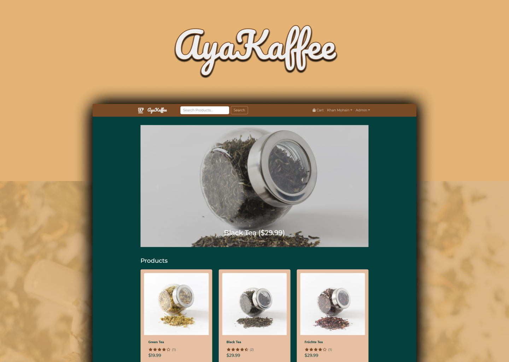

# iMart eCommerce Platform

<br />
<p align="center">
  <a href="https://ayakaffee-app.herokuapp.com/">
    
  </a>

  <h3 align="center">AyaKaffee | Ecommerce store </h3>

  <p align="center">
eCommerce platform built with the MERN stack & Redux. <br />
    <a href="m90khan@gmail.com"><strong>Contact Me</strong></a>
    <br />
    <br />
    <a href="https://ayakaffee-app.herokuapp.com/">View Demo</a>
    
   </p>
</p>

## Table of Contents

- [About the Project](#about-the-project)
- [Process](#process)
- [Skills](#skills)
- [Code Snipet](#code)
- [Connect with me](#Contact)

---

### About the Project

Live: https://ayakaffee-app.herokuapp.com/



#### Process

- Setup react environment with react-router.
- Implement the structure, divide it into components.
- Use Bootstrap on the frontend.

Features:

- Full featured shopping cart
- Product reviews and ratings
- Top products carousel
- Product pagination
- Product search feature
- User profile with orders
- Admin product management
- Admin user management
- Admin Order details page
- Mark orders as delivered option
- Checkout process (shipping, payment method, etc)
- PayPal / credit card integration
- Database seeder (products & users)

Case Study: https://www.behance.net/gallery/113528841/AyaKaffee?tracking_source=for_you_feed_user_published

---

### Skills

[][youtube]
[][youtube]
[][youtube]
[][youtube]
[][youtube]
[][youtube]

[][youtube]
[][youtube]
[][youtube]
<br />
<br />

---

### Code Snippet

```javascript
import React from 'react';
import PropTypes from 'prop-types';

const Rating = (props) => {
  const { value, text, color } = props;
  return (
    <div className='rating'>
      {[1, 2, 3, 4, 5].map((val) => (
        <span key={val}>
          <i
            style={{ color: color }}
            className={
              value && value >= val
                ? 'fas fa-star'
                : value && value >= val - 0.5
                ? 'fas fa-star-half-alt'
                : 'far fa-star'
            }
          ></i>
        </span>
      ))}

      {text && <span> ({text})</span>}
    </div>
  );
};

Rating.defaultProps = {
  color: '#7a4a25',
};
Rating.propTypes = {
  value: PropTypes.number,
  text: PropTypes.number,
  color: PropTypes.string,
};

export default Rating;
```

---

### Connect with me:

[][youtube]

[][twitter]
[][linkedin]
[][instagram]
[][behance]
[][dribble]
<br />

---

[youtube]: https://www.youtube.com/channel/UC96rVfdTKsjZpREnH6CaCOw
[twitter]: https://twitter.com/uxdkhan
[linkedin]: https://www.linkedin.com/in/uxdkhan
[instagram]: https://www.instagram.com/uxdkhan/
[behance]: https://www.behance.net/Khan_Mohsin
[dribble]: https://dribbble.com/uxdkhan
